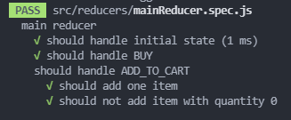
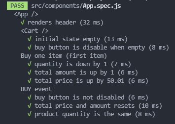

# React-Redux Assignment: shopping-cart with react redux

 

---

### My app -

**shopping cart features:**

- [x] you can add items to your shopping cart.
- [x] items are limited by quantity.
- [x] each item increases your total amount.
- [x] checkout button will reset your total amount (keeping the current item quantity in stock).
- [x] checkout button is disabled when cart is empty.
- [x] style your cart.
- [x] write tests for shopping cart app.

#### **Tests** -

- **mainReducer tests -**

### 

- **App tests** -

### 

---

#### Screen shots 🤳📸 -

## 

## 

---
